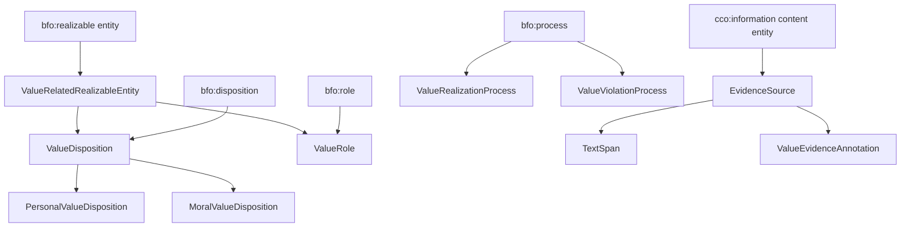

# ValueNet

ValueNet is an ontology of human values. **BFO-Aligned ValueNet** — the
maintained suite in this repository — represents a value not as a label
attached to a thing, but as a *realizable entity* that inheres in an agent and
is realized in the processes where that agent appraises, chooses, feels, or
acts. The suite is grounded in the Basic Formal Ontology (BFO) and reuses
Common Core Ontologies (CCO) terms for the information entities that carry
textual evidence.

---

## Why BFO alignment

Value vocabularies usually model a value as a category you assign to something.
That is easy to author and hard to reason with: it gives no account of *when* a
value is at stake, *who* holds it, or *what happened* when it was acted on or
violated.

BFO alignment buys three things:

- **A bearer.** A value disposition inheres in an agent. Asking whose value it
  is has an answer in the model, not in a naming convention.
- **A realization.** Holding a value and acting on it are different entities:
  the disposition persists, the
  [value realization process](ontology/bfo/core/valuenet-core.ttl) occurs. So
  is its counterpart, the value *violation* process, which lets the suite say
  that an act contravened a value without asserting the agent lacks it.
- **Interoperability by construction.** Because every class descends from a BFO
  or CCO term, ValueNet terms compose with other BFO-aligned ontologies instead
  of needing a bespoke bridge to each one.

---

## The core model



Every class above is declared in
[valuenet-core.ttl](ontology/bfo/core/valuenet-core.ttl).

**A worked example.** Honesty is a specific disposition, not a free-standing
tag. In the suite it sits on a chain of asserted subclass edges that ends in
BFO:

```
vn-folk:HonestyDisposition
  rdfs:subClassOf vn-folk:IntegrityDisposition
  rdfs:subClassOf vn-schwartz:UniversalismDisposition
  …
  rdfs:subClassOf vn-core:PersonalValueDisposition
  rdfs:subClassOf vn-core:ValueDisposition
  rdfs:subClassOf bfo:disposition
```

so a reasoner that knows an agent bears an honesty disposition also knows it
bears a BFO disposition, that the disposition inheres in *that agent*, and that
its realizations are processes. The definition ValueNet supplies for it — "a
personal value disposition to be truthful, sincere, and straightforward in
communication and action" — is authored text in
[valuenet-folk.ttl](ontology/bfo/core/valuenet-folk.ttl), not generated prose.

---

## Modules

| module | purpose |
|---|---|
| [valuenet-core.ttl](ontology/bfo/core/valuenet-core.ttl) | Top-level entities: the disposition/role split, realization and violation processes, and the textual-evidence chain. Everything else imports this. |
| [valuenet-schwartz-values.ttl](ontology/bfo/core/valuenet-schwartz-values.ttl) | Schwartz's ten Basic Human Values as BFO dispositions, used as the high-level classification for finer-grained terms. |
| [valuenet-folk.ttl](ontology/bfo/core/valuenet-folk.ttl) | The folk-value vocabulary — the large, specific layer people actually name in text — classified under the Schwartz values. |
| [valuenet-moral-foundations.ttl](ontology/bfo/extensions/moral-foundations/valuenet-moral-foundations.ttl) | Haidt's Moral Foundations (Care, Fairness, Loyalty, Authority, Sanctity) as dispositions, with the violation processes that contravene them. |
| [valuenet-moral-epistemics.ttl](ontology/bfo/extensions/moral-epistemics/valuenet-moral-epistemics.ttl) | The cognitive acts by which agents assess one another morally: behavioural observation, prudent discernment, and rash judgment. |
| [valuenet-mappings.ttl](ontology/bfo/core/valuenet-mappings.ttl) | Annotation-only correspondences from BFO-aligned terms to the original ValueNet and related value ontologies. Adds no logical axioms. |
| [vcvf-triggers-semantics.ttl](ontology/bfo/extensions/trigger-semantics/vcvf-triggers-semantics.ttl) | Supplies the definition ValueCore omits for the `vcvf:triggers` property. Annotation only; it declares no classes by design. |

[SHACL shapes](ontology/bfo/shapes) constrain the evidence chain and the
trigger semantics. Vendored dependencies —
[BFO core](ontology/bfo/vendor/bfo/bfo-core.ttl) and a
[pinned CCO extract](ontology/bfo/vendor/cco/cco-valuenet-extract.ttl) — are
upstream material, not ValueNet-authored modules.

Class and definition counts are derived from the ontology at build time rather
than copied here, so they cannot drift out of date in prose.

---

## Quick start

**Read a module.** Every module is Turtle and readable as text. Start with
[valuenet-core.ttl](ontology/bfo/core/valuenet-core.ttl).

**Download.** Clone the repository, or fetch individual `.ttl` files from
`ontology/bfo/`. A checksummed download bundle is planned; until it exists, the
repository is the distribution.

**Parse.**

```python
from rdflib import Graph

g = Graph().parse("ontology/bfo/core/valuenet-core.ttl", format="turtle")
print(len(g), "triples")
```

To load the suite with its imports resolved offline, parse the vendored
dependencies from `ontology/bfo/vendor/` rather than fetching the import IRIs —
see the note on IRI resolution below.

**Cite.** A citation record has not been issued yet. See
[Licensing, attribution, and citation](#licensing-attribution-and-citation).

### A note on IRIs

Canonical ValueNet IRIs identify ontology entities but are **not currently
HTTP-dereferenceable**. `https://fandaws.com/ontology/bfo/valuenet-core#…` is a
stable identifier, not a URL you can fetch today. Use the module files in this
repository to inspect definitions. The `https://w3id.org/valuenet/…` IRIs that
appear as `rdfs:seeAlso` are reserved aliases that are not registered; nothing
is declared under them and no query should rely on them.

---

## Browsing the ontology

A public class explorer and a set of explanatory BFO diagrams are planned and
are not yet deployed. This README deliberately does not link to a site that
does not exist. Until it does, the module files above and the
[competency questions](ontology/bfo/extensions/moral-epistemics/valuenet-moral-epistemics-CQ.md)
are the way in. Progress and scope for the public site are recorded in the
[publication plan](docs/architecture/PUBLICATION_AND_GITHUB_PAGES_PLAN.md).

---

## Original ValueNet and BFO-Aligned ValueNet

ValueNet began as a DUL-aligned suite, and that work is the source tradition
this one builds on. It is present in this repository and remains readable:
[ValueCore.ttl](ValueCore.ttl), [bhv.ttl](bhv.ttl), [mft.ttl](mft.ttl),
[wvs.ttl](wvs.ttl), the [moral-foundation trigger frames](MFTriggers), and the
[folk-value corpus](ThatsAllFolks). See the
[original ValueNet overview](docs/original-valuenet/README.md).

The two are not competing versions of one thing:

- **Original ValueNet** supplies the conceptual vocabulary, the lexical trigger
  data, and the empirical corpora. It is the mapping target, not a deprecated
  release.
- **BFO-Aligned ValueNet** re-expresses that vocabulary under an upper ontology
  so it composes with other BFO-aligned work, and records the correspondence
  explicitly in
  [valuenet-mappings.ttl](ontology/bfo/core/valuenet-mappings.ttl) using
  annotation properties that assert historical and conceptual correspondence
  without claiming logical equivalence.

Neither supersedes the other. The mappings are annotations precisely because
"this term corresponds to that one" is a weaker and more honest claim than
`owl:equivalentClass`.

---

## Validation and reproducibility

Ontology changes in this repository are measured, not asserted. The measurement
apparatus produces a semantic fingerprint of the whole corpus that is
independent of where the repository is checked out:

- [config/semantic-baseline.json](config/semantic-baseline.json) records what
  the current commit measures — corpus counts, a ground digest over every
  triple with no blank node, a blank-node fingerprint, and reasoner results.
- [config/eol-transition-matrix.json](config/eol-transition-matrix.json)
  records the experiment that made those digests reproducible, by measuring the
  corpus under three different parsing and line-ending conditions.
- [config/remediation-record.json](config/remediation-record.json) enumerates
  every source-data repair made since that experiment, triple by triple, so a
  digest that moved can be attributed to a specific change.
- [config/reorganization-baseline.json](config/reorganization-baseline.json) is
  the historical evidence bracketing a 99-file repository reorganization.

Tagged checkpoints: `reorg-pre-move-v1`, `reorg-post-move-v1`, and
`eol-hardened-v1`. [PROVENANCE.md](docs/architecture/PROVENANCE.md) records
where the material came from.

**MAREP** is the audit framework that produces this evidence. It is
documentation *about* the work rather than something a user of the ontology
needs: see [marep/README.md](marep/README.md) and the
[testing framework](docs/bfo/guides/TestingFramework.md).

---

## Repository layout

[config/repository-layout.yaml](config/repository-layout.yaml) is authoritative
for where things live; tools resolve paths through it rather than hard-coding
them.

| directory | contents |
|---|---|
| [ontology/bfo/](ontology/bfo) | BFO-Aligned ValueNet: core, extensions, shapes, and vendored dependencies. |
| [docs/](docs) | Guides, architecture records, and remediation history. |
| [tools/](tools) | Generators and checkers, including the evidence pipeline. |
| [tests/](tests) | The test suite, including ontology and evidence checks. |
| [marep/](marep) | The MAREP audit framework. |
| [config/](config) | The layout contract, move manifest, and evidence artifacts. |
| [MFTriggers/](MFTriggers), [ThatsAllFolks/](ThatsAllFolks) | Original ValueNet trigger frames and folk-value corpus. |

Contributor guides: [annotation guide](docs/bfo/guides/annotationGuide.md),
[BFO alignment rationale](docs/bfo/guides/BFOizing%20ValueNet.md).

---

## Licensing, attribution, and citation

**No project license has been issued yet.** Until a `LICENSE` file exists at the
repository root, no reuse terms are granted for ValueNet-authored material, and
you should not infer terms from the vendored BFO or CCO files — those carry
their own upstream licenses and are included as dependencies.

A `LICENSE`, a `THIRD_PARTY_NOTICES.md` separating upstream material, and a
`CITATION.cff` are the first deliverables of the publication plan and are
required before any public release. If you want to use this material now, ask
first.
